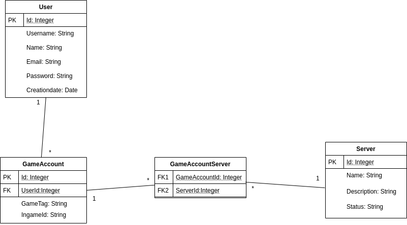

# ServdCraft

#### Web application for managing user access for your game servers

#### In Progress. These specs can and will change drastically

Idea is based on a need for a managing system for whitelisting users for Minecraft servers.
Users can register and add their in game usernames under their account. Users need to send a request to get an access on the server. User can have one or more in game accounts and all of them have separate permissions. 

---
### Week 1
Cruder concept database diagram for the basic logical structures. Other tables will be needed in the future for example tabels loginsa and requestStates.   

 

